# aws Lightsail https

## Introduction

    AWS Lightsailを使用し、https化してJavaサービスを動かす手法です。  
    デフォルトドメインの場合、証明書が何処にあるか不明となってしまうので  
    Let's Encrypt を使用して証明書を取得します。  
    そのため、独自ドメインをお名前ドットコムで取得しています。  

## Dependency

    AWS Lightsail  
    Java 8.0(11.0)  
    Ubuntu 22.04  

## Contract

    AWS Lightsail を利用する設定を行います。  
    契約してLightsailコンソールへアクセスできるようにしてください。  


## Lightsail(AWS Console) 

### Create instance

1. ホーム画面にアクセスし、「インスタンスの作成」を選択します。  

  

2. リージョンを作成する場所を選択します。金額には影響が無いようなので、「東京」を選択します。  

  

3. インスタンスイメージを設定します。プラットフォーム、設計図の選択は図のように選択します。  

  

4. オプションは特に設定を行いません。  

  

5. プランの選択です。ここでは最も安いプランを選択します。  

  

6. インスタンス名を設定します。一意でわかりやすい名前にしましょう。ここではデフォルト名のままにしています。  

  

7. 無事、インスタンスが作成されました。黒塗りつぶし箇所はIPアドレスが表示されます。  

  


### Create static ip

1. 作成したインスタンスを選択します。今のままではサーバーが再起動するたびにIPアドレスが変わってしまいます。  
なので、静的IPアドレスを割り当てます。アタッチしていない静的IPアドレスはお金が発生しますので気を付けてください。  
作成したインスタンスを選択すると、SSHでの接続方法などが表示されます。その画面の「ネットワーキング」を開きます。  
現在のIPアドレスが表示されたページへ遷移します。同画面の「静的IPをアタッチする」を選択します。  

  

2. 静的IPの名前を設定します。管理しやすい名前を付けましょう。入力したら、「作成およびアタッチ」を選択します。  

  

3. 無事、作成されました。「続行する」で作業を続けます。

  

取得した静的IPアドレスは、お名前どっとこむのDNS設定で入力が必要になります。  


### Add firewall config

1. 「ネットワーキング」の画面では、静的IP設定以外にもファイアーウォールの設定を行うことも可能です。  
HTTPS通信を行う際、任意のポートを指定する場合は設定が必要になります。  
ここでは、「8443」を利用する設定を行います。  
「ルールの追加」を選択します。  

  

2. アプリケーション、プロトコル、ポートまたは範囲に入力します。  
出来たら「作成」を選択します。  
接続可能なIPアドレスの制限などが必要な場合、「IPアドレスに制限する」のチェックを付与します。  
設定項目が新たに表示されます。  

  


### Create distribution

1. ディストリビューションを作成します。私の理解では、コンテンツ表示が高速化するものだと思っています。  
画面左のメニューから「ネットワーキング」を選択します。  

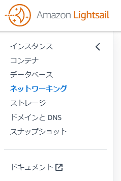  

2. 「ディストリビューションを作成する」を選択します。

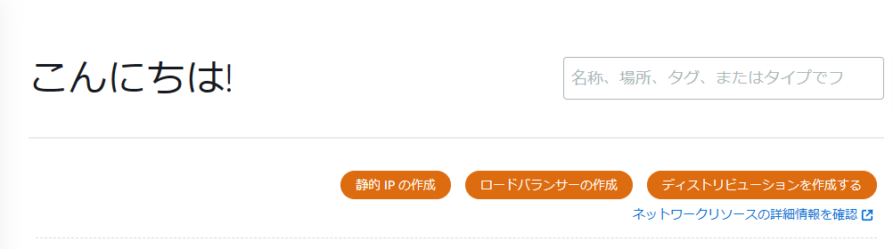  

3. オリジンの選択では、インスタンスと静的IPを選択します。ここでは先ほど作成した「Ubuntu-1」を選択します。  
表示されない場合、リージョンが異なる場所に割り当たっている可能性もあるので、東京を選択しましょう。  

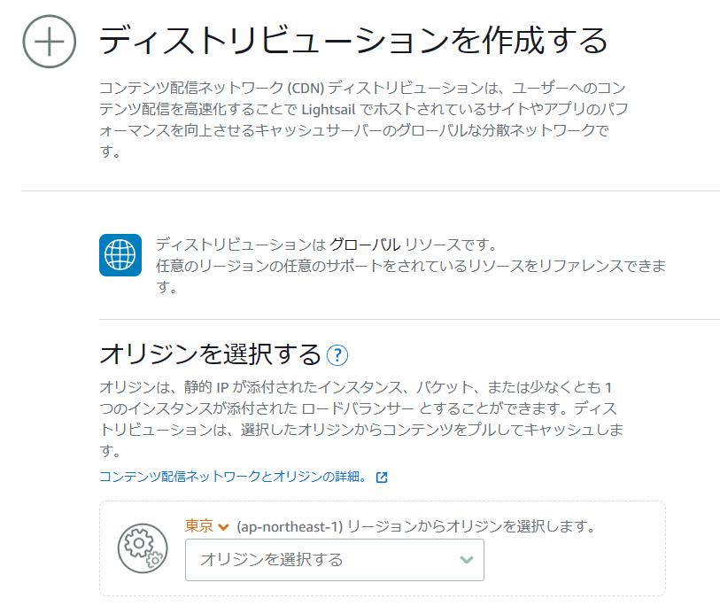  
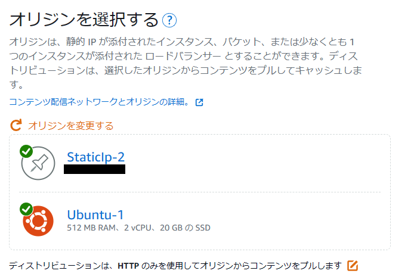  

4. キャッシュ動作には「静的コンテンツに最適」を選択します。

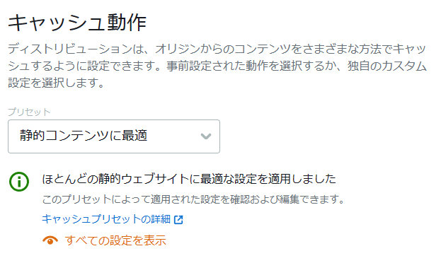  

5. ディストリビューションのプランを選択します。一番安いので行きます。  

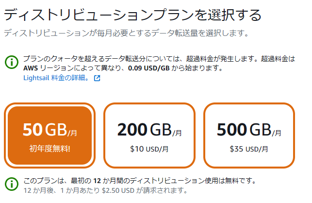  

6. ディストリビューションの識別名を登録します。わかりやすい名前にしましょう。  
入力したら「ディストリビューションを作成する」を選択します。  

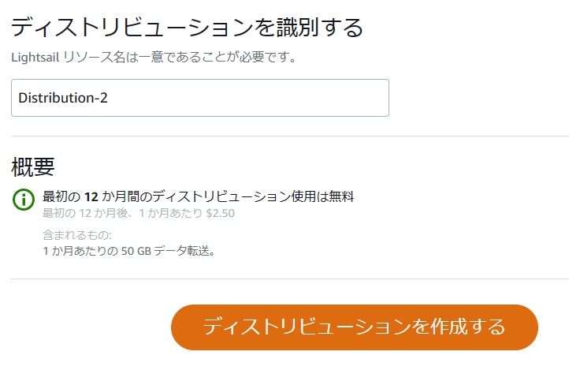  


## お名前どっとこむ

ここからはお名前どっとこむでのドメイン関連を設定する方法について記載します。  
ドメインは取得済みとして作業しています。  

### DNS setting

1. お名前どっとこむの管理ページへログインします。  
通常、ドメインのページが表示されますので、その隣の「ネームサーバーの設定」を選択します。
リストが表示されるので、「ドメインのDNS設定」を選択します。

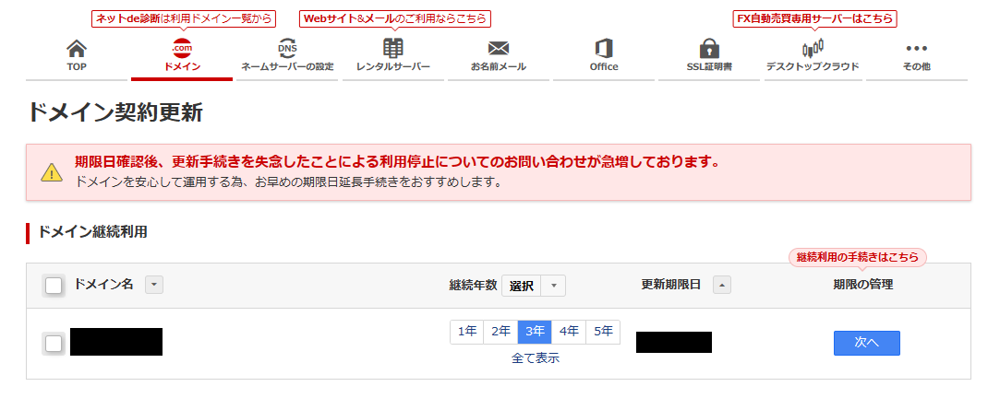  
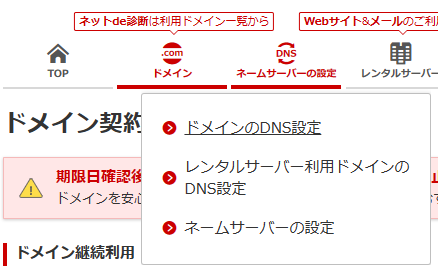  

2. ドメイン設定画面が表示されます。対象のドメインのラジオボタンを選択したら「次へ」で進みます。  

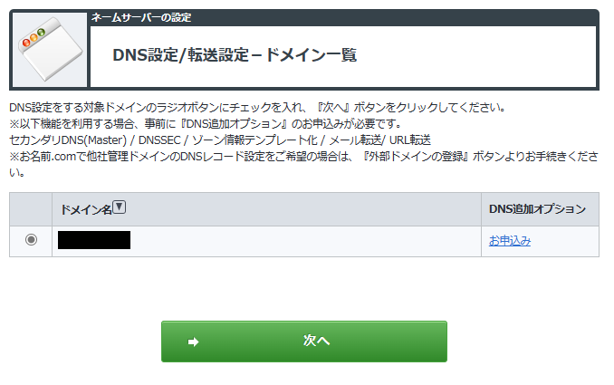  

3. DNS設定にて「DNSレコード設定を利用する」を設定しますので「設定する」を選択します。  

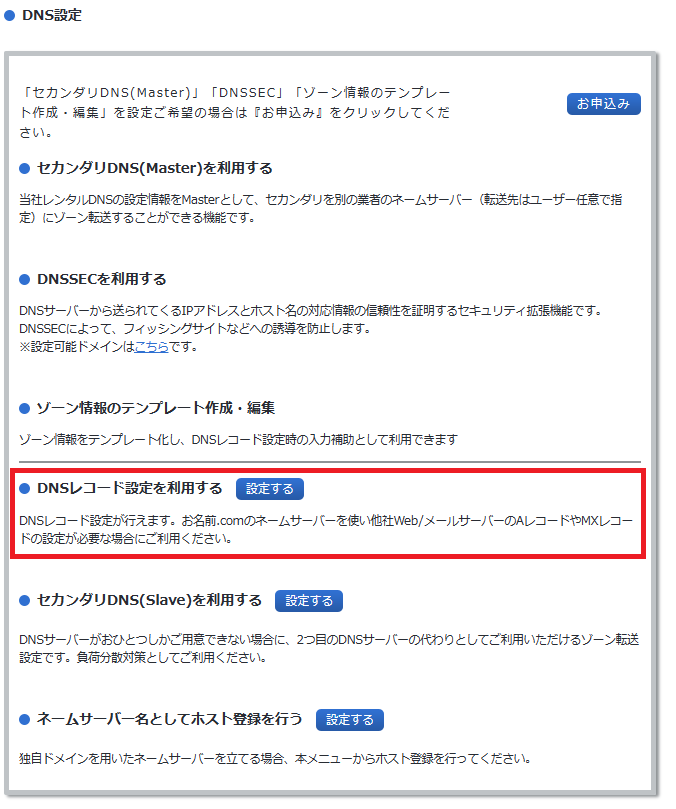  

4. 入力エリアが現れます。  
ホスト名には一意な識別文字列を入力します。  
VALUEにはLightSailの静的IP設定にて取得したIPアドレスを入力します。  
その他はデフォルトで良いです。  
登録出来たら「追加」で進めてます。  

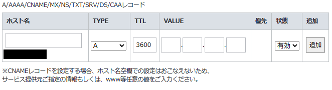  

5. 追加が正常に終了したら、DNS Lookupサイトなどで反映されているかを確認します。  
こういうサイトです。  
[https://www.cman.jp/network/support/nslookup.html](https://www.cman.jp/network/support/nslookup.html)

ここで入力するホスト名は、取得したドメインになるので注意してください。  
先ほど入力した、一意なホスト名も含めたURLではありません。  
nslookupが成功したら正しく反映されています。  
お名前どっとこむのサイト上にも記載がありますが、反映に時間を要する場合がありますのでご注意ください。  


## Lightsail(ssl setting)

ドメインと静的IPアドレスの紐づけが出来たので、SSLの設定を行います。  
ここではLet's Encryptを用いて証明書を発行、使用します。  

### Install web server(ex. apache2)

「apache2 インストール」などの文字で検索したらいっぱい出てきます。  
そのため、大体こんな感じの手順を記載します。  

apache2のインストール  

``` shell
sudo apt update  
sudo apt install  apache2  
```

apache2の起動状態チェック  

``` shell
systemctl status apache2
```

「Active:」が緑色で「active(running)」になっている場合は起動しています。  
起動してない場合は起動しましょう。  

``` shell
systemctl start apache2
```

Webページとして公開する場合のディレクトリは以下になります。  

    /var/www/html  

apache2インストール時、そこに「index.html」が自動生成されると思います。  
無ければ作ります。  

「index.html」が存在する状態で以下のURLへアクセスすると、「It works!」ページか、準備したWebページが表示されます。  

[http://IPADDRESS](http://IPADDRESS)


### Install Java(ex. Java11)


### Install Certbot

Let's Encryptを用いるので、Certbotを利用します。  

``` shell
sudo apt update  
sudo apt install certbot  
```

## Generate PKCS12 file

「certbot」をインストールしたら、さっそく実行します。  

``` shell
sudo certbot certonly --standalone
```

画面指示に従ってドメイン名やメールアドレスを入力します。  

Javaで利用する場合、Keystore形式に変換する必要があります。  
先ほど作成したファイルを利用して、pkcs12ファイルを作成します。  
以下のコマンドはサーバー上で実行してください。  
「<yourdomain.com>」には、証明書発行に使用したドメイン名で読み替えてください。  
「<path/to/your/dir/>」は出力先ディレクトリパスを指定します。  

``` shell
sudo openssl pkcs12 -export -in /etc/letsencrypt/live/<yourdomain.com>/fullchain.pem -inkey /etc/letsencrypt/live/<yourdomain.com>/privkey.pem -out <path/to/your/dir/>keystore.p12 -name tomcat -CAfile /etc/letsencrypt/live/<yourdomain.com>/chain.pem -caname root
```

正常に出力されれば、「/path/to/your/dir/keystore.p12」が出力されます。  

## Setup the spring boot

「spring boot」の設定ファイル(application.ymlなど)にSSL証明書の設定を行います。  

``` yaml
server:
  port: 443
  ssl:
    key-store: /path/to/your/dir/keystore.p12
    key-store-password: <作成時に設定したPW>
    key-store-type: PKCS12
    key-alias: tomcat
```

「port」はファイアーウォールの設定で開いたポートを設定します。  

## Deploy

設定が出来たらJavaApplicationをビルドしてデプロイします。  
デプロイが成功したら、サーバーを起動します。  
ドメインへアクセスし、HTTPS通信が行えることを確認しましょう。  

## Result

    


