# aws Lightsail https

## Introduction

    AWS Lightsailを使用し、https化してJavaサービスを動かす手法です。  
    デフォルトドメインの場合、証明書が何処にあるか不明となってしまうので  
    Let's Encrypt を使用して証明書を取得します。  
    そのため、独自ドメインをお名前ドットコムで取得しています。  

## Dependency

    AWS Lightsail  
    Java 8.0(11.0)  
    Ubuntu 22.04  

## Contract

    AWS Lightsail を利用する設定を行います。  
    契約してLightsailコンソールへアクセスできるようにしてください。  

## Lightsail(AWS Console) 

### Create instance

1. ホーム画面にアクセスし、「インスタンスの作成」を選択します。  

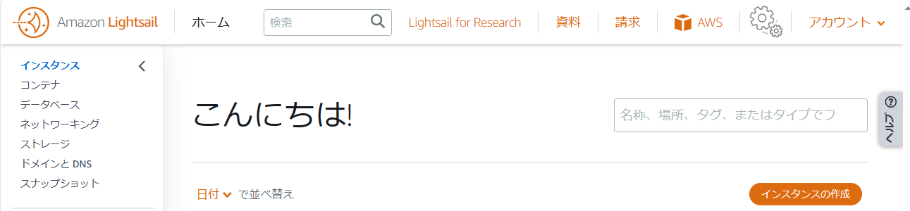  

2. リージョンを作成する場所を選択します。金額には影響が無いようなので、「東京」を選択します。  

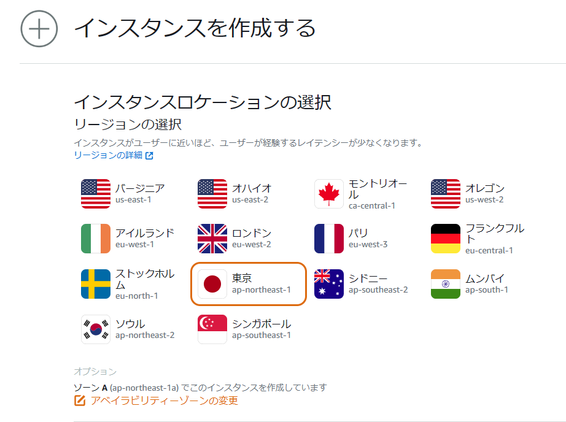  

3. インスタンスイメージを設定します。プラットフォーム、設計図の選択は図のように選択します。  

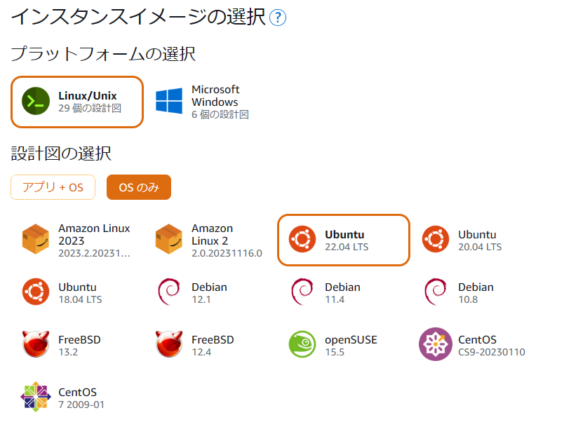  

4. オプションは特に設定を行いません。  

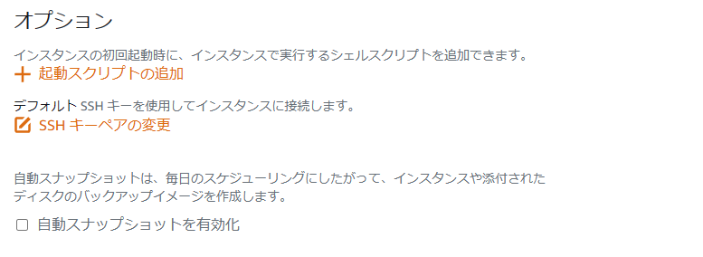  

5. プランの選択です。ここでは最も安いプランを選択します。  

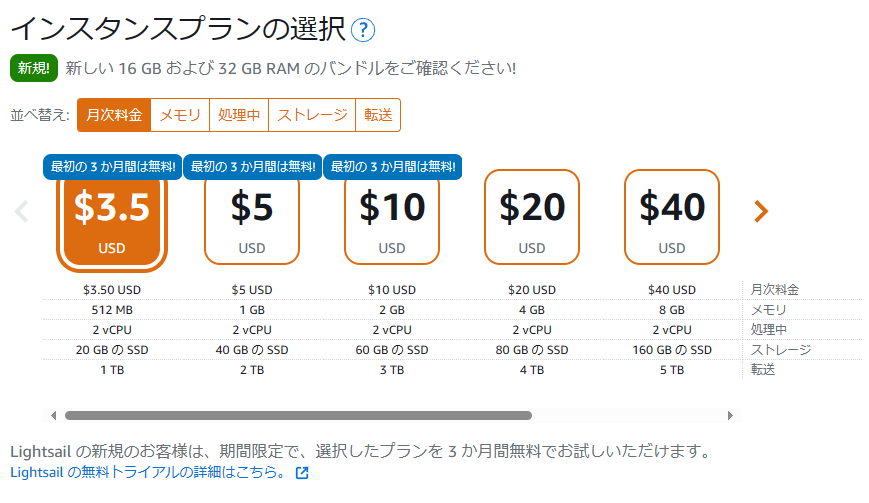  

6. インスタンス名を設定します。一意でわかりやすい名前にしましょう。ここではデフォルト名のままにしています。  

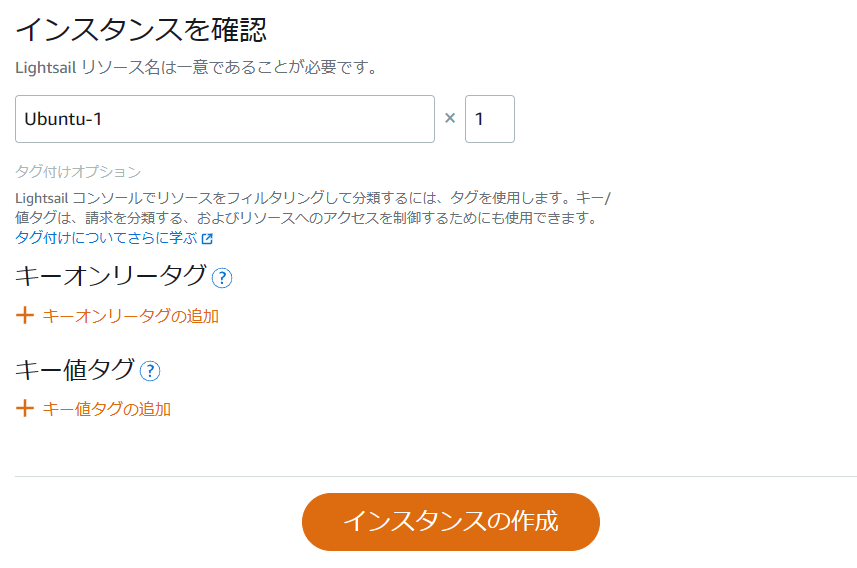  

7. 無事、インスタンスが作成されました。黒塗りつぶし箇所はIPアドレスが表示されます。  

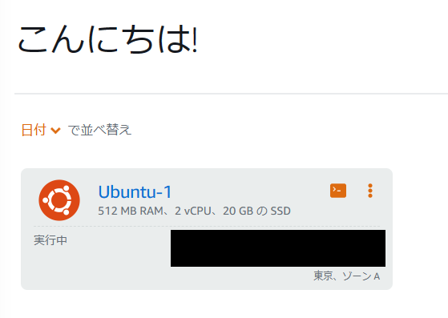  

### Create static ip

1. 作成したインスタンスを選択します。今のままではサーバーが再起動するたびにIPアドレスが変わってしまいます。  
なので、静的IPアドレスを割り当てます。アタッチしていない静的IPアドレスはお金が発生しますので気を付けてください。  
作成したインスタンスを選択すると、SSHでの接続方法などが表示されます。その画面の「ネットワーキング」を開きます。  
現在のIPアドレスが表示されたページへ遷移します。同画面の「静的IPをアタッチする」を選択します。  

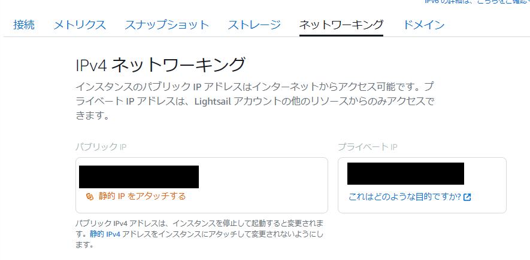  

2. 静的IPの名前を設定します。管理しやすい名前を付けましょう。入力したら、「作成およびアタッチ」を選択します。  

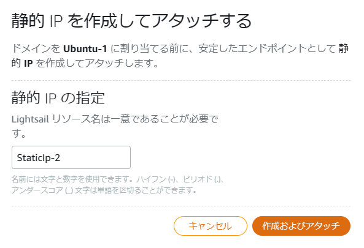  

3. 無事、作成されました。「続行する」で作業を続けます。

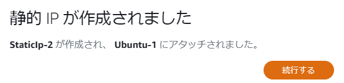  

### Add firewall config

1. 「ネットワーキング」の画面では、静的IP設定以外にもファイアーウォールの設定を行うことも可能です。  
HTTPS通信を行う際、任意のポートを指定する場合は設定が必要になります。  
ここでは、「8443」を利用する設定を行います。  
「ルールの追加」を選択します。  

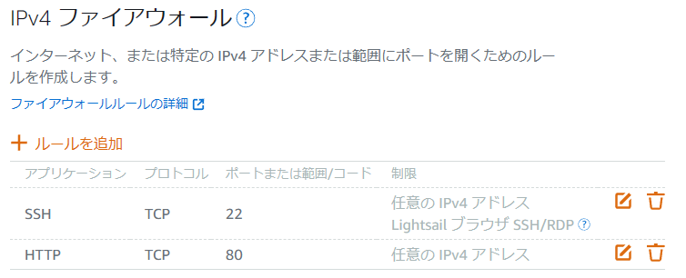  

2. アプリケーション、プロトコル、ポートまたは範囲に入力します。  
出来たら「作成」を選択します。  
接続可能なIPアドレスの制限などが必要な場合、「IPアドレスに制限する」のチェックを付与します。  
設定項目が新たに表示されます。  

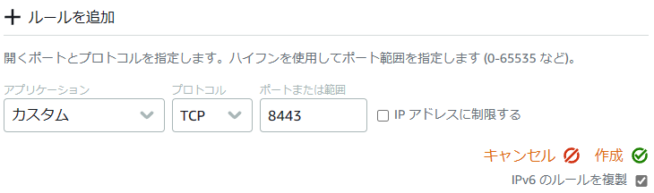  

### Create distribution

## お名前どっとこむ

### DNS setting

## Lightsail(ssh setting)

### Install web server(ex. apache2)

### Install Java(ex. Java11)

## Result

    

